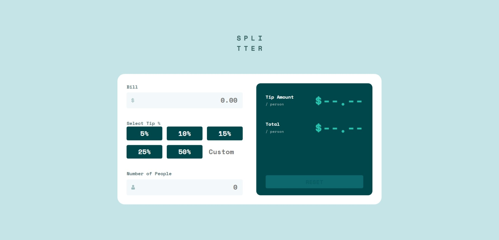
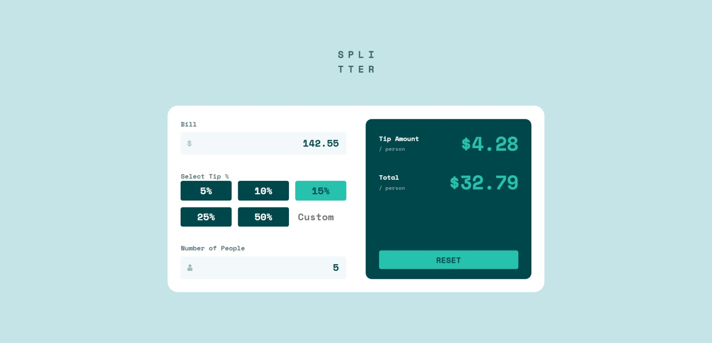
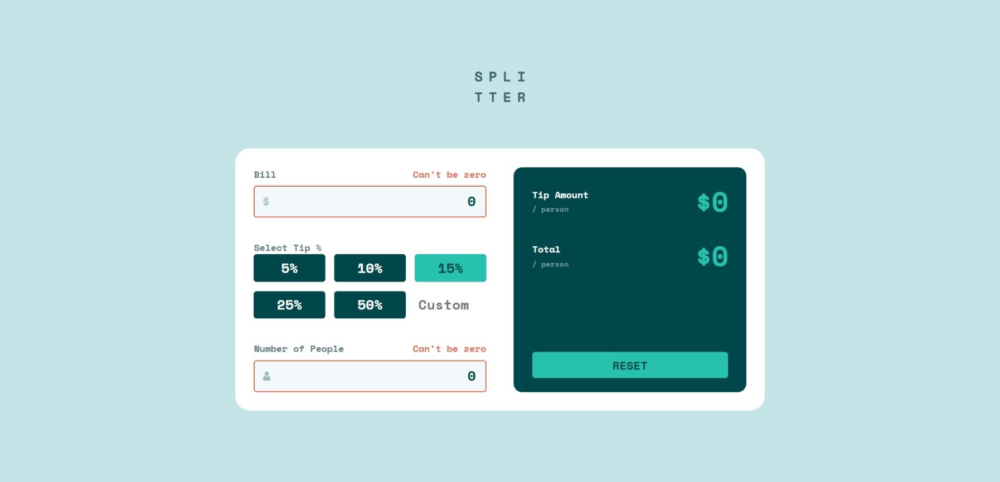

# Frontend Mentor - Tip calculator app solution

This is my solution to the [Tip calculator app challenge on Frontend Mentor](https://www.frontendmentor.io/challenges/tip-calculator-app-ugJNGbJUX).

## Table of contents

- [Overview](#overview)
  - [The challenge](#the-challenge)
  - [Screenshot](#screenshot)
  - [Links](#links)
  - [What I learned](#what-i-learned)
- [My process](#my-process)
  - [Built with](#built-with)
- [Author](#author)

## Overview

### The challenge

Users should be able to:

- View the optimal layout for the app depending on their device's screen size
- See hover states for all interactive elements on the page
- Calculate the correct tip and total cost of the bill per person

### Screenshot

## Screenshot at normal state



## Screenshot at active state



## Screenshot at error state



### Links

- Solution URL: [repo link](https://github.com/Vinicius-PR/tip-calculator-app)
- Live Site URL: [solution link](https://tip-calculator-app-gamma-ten.vercel.app/)

## My process

### Built with

- Semantic HTML5 markup
- CSS custom properties
- Flexbox
- CSS Grid

### What I learned

I learned more about regex. In this challenge, I used it to control the input for the bill amount and the number of people.

For the bill I did:
```js
billInput.addEventListener('input', () => {
  cleanErrors()
  billInput.value = billInput.value
    .replace(',', '.') // Converts comma to dot
    .replace(/[^0-9.]/g, '') // Remove everything that is NOT a number or a dot
    .replace(/(\..*?)\..*/g, '$1') // Keep only the first dot and remove the rest
    .replace(/(\.\d{2}).+/, '$1') // Keep only 2 decimal places and remove the rest
  billValue = billInput.value
  runCalculationAndUpdate(billValue, percentageValue, numberOfPeople)
})
```
With this regex, it will receive only number with max 2 decimals

For the number of people I did:
```js
numberOfPeopleInput.addEventListener('input', () => {
  cleanErrors()
  numberOfPeopleInput.value = numberOfPeopleInput.value
    .replace(/[^0-9.]/g, '') // Remove everything that is NOT a number or a dot
    .replace(/\./g, '') // Remove ALL dots
  numberOfPeople = numberOfPeopleInput.value
  runCalculationAndUpdate(billValue, percentageValue, numberOfPeople)
})
```
Here we allow the first *dot*, then removing it. So this input is forced to be an integer only.

## Author

- Frontend Mentor - [@Vinicius-PR](https://www.frontendmentor.io/profile/Vinicius-PR)
- Linkedin - [@Vinicius](https://www.linkedin.com/in/vinicius-paula-resende/)